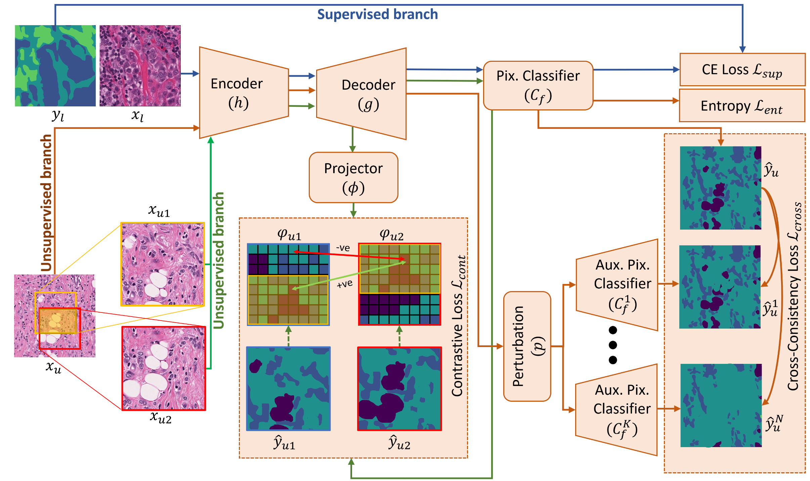

# Consistency Regularisation in Varying Contexts and Feature Perturbations for Semi-Supervised Semantic Segmentation of Histology Images
Raja Muhammad Saad Bashir, Talha Qaisera, Shan E Ahmed Razaa, Nasir M. Rajpoot


<div align="center">
  
</div>

# Highlight 
1. A semi-supervised learning (SSL) framework utilising consistency regularisation against varying contexts and perturbations.
2. Proposed novel combination of context-aware consistency loss and cross-consistent training for feature generalisability with entropy minimisation.
3. Demonstrated our method on two different semantic segmentation tasks i.e., tissue segmentation and nuclei segmentation on two publicly available large histology data sets.
4. Extensive experiments showed superior performance of our method outperforming the state-of-the-art (SOTA) SSL methods with extensive ablation studies.
5. Based on [**CAC**](https://github.com/dvlab-research/Context-Aware-Consistency) and [**CCT**](https://github.com/yassouali/CCT), this Repository also supports efficient distributed training with multiple GPUs.

# Get Started
## Environment
The repository is tested on Ubuntu 18.04.3 LTS, Python 3.6.9, PyTorch 1.6.0 and CUDA 10.2
```
pip install -r requirements.txt
```

## Datasets Preparation
1. Firstly, download the [BCSS](https://github.com/PathologyDataScience/BCSS) and [MonuSeg](https://monuseg.grand-challenge.org/) Dataset.
2. Create train and test sets using the follwing guide https://bcsegmentation.grand-challenge.org/Baseline/.
3. Extract patches from train and test for both the datasets.
4. Configure the paths in the config/ files for both datasets

## Training

Firsly, you should download the PyTorch ResNet101 or ResNet50 ImageNet-pretrained weight, and put it into the 'pretrained/' directory using the following commands.

```
cd crcfp
mkdir models/backbone/pretrained
cd pretrained
wget https://download.pytorch.org/models/resnet50-19c8e357.pth # ResNet50
wget https://download.pytorch.org/models/resnet101-5d3b4d8f.pth # ResNet101
```

Or run the file 

```/model/get_pretrained_model.sh```

Run the following commands for training.

train the model on the 1/8 labeled data by setting the value of n_labelled_examples = 8 and config_dir = data/tnbc/config_1
```
python3 train.py --config configs/bcss_config_file.json
```


# Related Repositories

This repository highly depends on the **CCT** repository at https://github.com/yassouali/CCT and **CAC** repository at https://github.com/dvlab-research/Context-Aware-Consistency. We thank the authors for their great work and clean code.


# Citation
If you find this project useful, please consider citing:

```
@article{bashir2023consistency,
  title={Consistency Regularisation in Varying Contexts and Feature Perturbations for Semi-Supervised Semantic Segmentation of Histology Images},
  author={Bashir, Raja Muhammad Saad and Qaiser, Talha and Raza, Shan E Ahmed and Rajpoot, Nasir M},
  journal={arXiv preprint arXiv:2301.13141},
  year={2023}
}
```